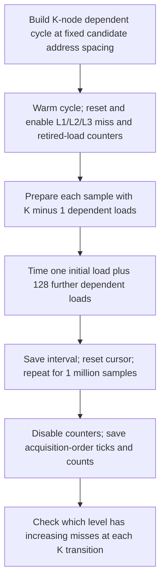

# Associativity PMU verification

Sunbird: [associativity01](results/sunbird/associativity01/RUN_NOTES.md). Its frozen
candidate layouts use 4 KiB and 32 KiB spacing, with K=6,7,8,9,10,12 for each;
CPU 32/node 0; and two PMU pairs per point. No K extension is needed. The historical
K values, placement and failed `associativity01` discussed below refer to Artemisia.

Charnwood's completed run is [associativity01](results/charnwood/associativity01/RUN_NOTES.md), with
[Section 8.3 comparison and limitations](../results/charnwood/REPORT.md).

Artemisia's completed run is [associativity02](results/artemisia/associativity02/RUN_NOTES.md).
It confirms the L1 conflict threshold and identifies the original L2-labeled 12-to-13 transition
as an L1 miss transition. Two extension points provide evidence for a later L2 threshold.

From this directory:

```bash
make all
python3 scripts/run_associativity.py --machine artemisia --run-id associativity03 --dry-run
python3 scripts/run_associativity.py --machine artemisia --run-id associativity03
python3 scripts/analyze_associativity.py --machine artemisia --run-id associativity03
```

Use a new run ID for collection. Dependencies and shared functional checks are the same as
the [line-size verification](../line_size/README.md).

## Method and selected points

The existing timing-only conflict-cycle construction is retained: K nodes have spacing
`num_sets * line_size`, their order is shuffled with `mt19937(seed + K * 100)`, and the worker
warms that cycle before collecting 1,000,000 batches. One K is measured per process.

| Address-spacing candidate | Parameters | K values |
|---|---|---|
| L1 | 64 candidate sets * 64 B = 4 KiB | 10, 11, 12, 13, 14 |
| L2 candidate | 2,048 candidate sets * 64 B = 128 KiB | 11, 12, 13, 14, 16, 17, 18 |

The original candidate sweep stopped at K=16. K=17 and K=18 are explicitly new verification
points and have no original timing-only baseline. For existing points, `max_k=16`; for the
extensions it is raised just enough to contain K. The original threshold calibration is retained
outside PMU collection, but its timing-derived eviction probability is not used as a per-level
hardware miss probability or to select the PMU result.

The requested batch is 128, warm-up is 1,000 traversals, and base seed is 701. CPU 32 and local
NUMA node 1 replace the occupied original CPU 4/node 0; this difference is recorded. Allocations
use the original mmap/MADV_HUGEPAGE path, with actual page backing now logged before and after
measurement. Every completed associativity point had full 2 MiB THP backing.



## Actual load counts and limits

The original measurement loop contains an initial `p->next` load and then 128 `q->next` loads:
**129 timed chain loads per sample**. Its summary divided ticks by 128. New statistics divide by
129 and retain `legacy_median` using the original divisor. The comparison graph also rescales
the original summary by 128/129; original data files are not edited.

Counters cover the whole sample loop, including K-1 untimed preparation loads. Therefore the
normalization denominator is `samples * (K + 128)`, not `samples * 128` or `samples * 129`.
Counts also include C++ helper/stack loads, and can exceed the known number of chain loads.
These are misses per 1,000 known chain loads, not exact per-target eviction probabilities.

The PMU group is disabled during allocation, calibration, warm-up, sorting, and file output.
Latency storage is prefaulted, and acquisition-order raw ticks are saved before the original
sort. The original legacy summary/threshold output remains available under `data/.../legacy/`.
The same timer, timed dependency loop, candidate spacing, and shuffle method are retained;
stack layout, prefaulted storage, single-K process state, and CPU/socket placement can affect
absolute timing. `-O0` timer/loop overhead is included and TSC ticks are not core cycles.

A stride that targets an L2 set can also target one L1 set. A timing increase alone therefore
cannot label the L2 associativity. The separate L1 and L2 miss events are the decisive evidence.
This run supports effective thresholds for the tested conflict layout, not a universal proof
of every set's mapping/replacement policy. LLC associativity is not tested.

## Evidence and reproducibility

The data directory contains raw gzip timings, PMU JSON counts, legacy summaries, exact commands,
environment, build and mapping/interference logs, and manifest status. The results directory
contains full statistics, PMU normalization, temporal medians, quality/validation records, and
PNG/PDF comparison and distribution figures. No raw outliers are removed.

`associativity01` failed before measurement because numactl interpreted the inherited affinity
mask as its CPU selection limit and rejected CPU 32. Its failure log is retained; it contains no
timing samples. The runner now uses taskset before numactl, successfully selecting the CPU through
the OS affinity interface. `associativity02` is the complete run used for analysis.

Shared helpers are under `../common/` and `../capacity/scripts/common.py`. The runner supports
Linux x86-64; different PMUs need verified event encodings. Literature/system comparison and
global associativity claims remain separate from this experimental validation.
