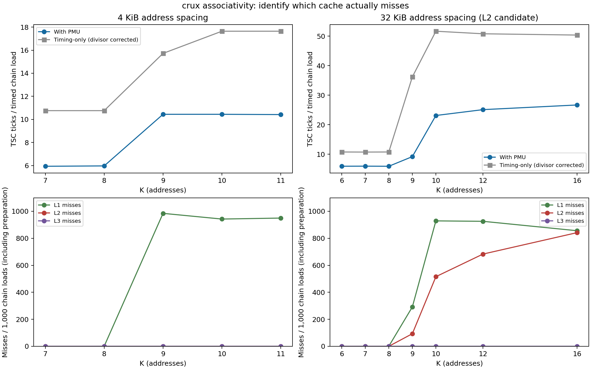

# Crux associativity PMU verification: associativity01

Completed 12 configurations with 1,000,000 timed batches each (12 million total), from 2026-09-14T15:40:15.947084+00:00 to 2026-09-14T15:40:30.963050+00:00. Total collection elapsed time: 15.02 seconds. All points use the four locally verified retired L1/L2/L3 load-miss and retired-load events.

[总体结论、系统/Agner 对照及分歧分析](../../../../results/crux/verification01/README.md)；[对照表](../../../../results/crux/verification01/comparison.md)。

CPU 4 / NUMA node 0; seed 701; requested batch 128; 1000 warm-up traversals. L1 candidate: 4 KiB spacing, K=7,8,9,10,11. L2 candidate: 32 KiB spacing, K=6,7,8,9,10,12,16. Every mapping retained 2 MiB THP backing. All selected K points have a frozen baseline; no extension points were needed.

L1 K=8→9 produces L1 misses 0.333→984.504 per 1000 chain loads with negligible L2 misses, supporting 8 ways and disagreeing with the original 9-way selector. The L2 candidate has real L2 misses starting at K=9, but its 32 KiB spacing can cover two 4-way L2 sets under the system’s 1024-set geometry. An 8-address threshold is not proof of a single 8-way L2 set. This is a geometry-based explanation, not independent physical-set mapping.

The actual timed loop performs 129 chain loads. New timing and the baseline comparison use divisor 129; `legacy_median` retains divisor 128. PMU also counts K−1 preparation loads, so normalization is `samples * (K + 128)`. The substantial absolute timing difference from Phase I is retained and discussed in the main report; it is not silently corrected away.

| Point | Median TSC ticks / timed chain load | L1 misses / 1000 | L2 misses / 1000 | L3 misses / 1000 |
|---|---:|---:|---:|---:|
| L1_k7 | 5.9380 | 0.033 | 0.001 | 0.001 |
| L1_k8 | 5.9690 | 0.333 | 0.003 | 0.003 |
| L1_k9 | 10.4419 | 984.504 | 0.001 | 0.001 |
| L1_k10 | 10.4419 | 942.354 | 0.000 | 0.000 |
| L1_k11 | 10.4186 | 949.603 | 0.008 | 0.008 |
| L2_candidate_k6 | 5.9380 | 0.022 | 0.006 | 0.002 |
| L2_candidate_k7 | 5.9612 | 0.032 | 0.008 | 0.001 |
| L2_candidate_k8 | 5.9225 | 0.323 | 0.019 | 0.000 |
| L2_candidate_k9 | 9.1860 | 291.501 | 93.189 | 0.001 |
| L2_candidate_k10 | 23.1163 | 928.759 | 515.644 | 0.001 |
| L2_candidate_k12 | 25.1008 | 925.622 | 682.980 | 0.002 |
| L2_candidate_k16 | 26.6822 | 855.881 | 841.860 | 0.002 |

These counts include loop/helper loads and are not conditional cache-miss probabilities. Timing is in TSC ticks, includes overhead, and is not a calibrated core-cycle hit latency. Raw outliers are retained.

[Statistics](summary.csv), [PMU counts](pmu_counts.csv), [quality](quality.json), [validation](validation.json), [data manifest](../../../data/crux/associativity01/manifest.json), [source/binary archive](../../../data/crux/associativity01/reproduction/provenance.json). The latter is a post-collection snapshot; Phase-I was frozen separately before PMU probes.

[Comparison PDF](figures/associativity_pmu_validation.pdf); [box plots PNG](figures/latency_boxplots.png) / [PDF](figures/latency_boxplots.pdf).
