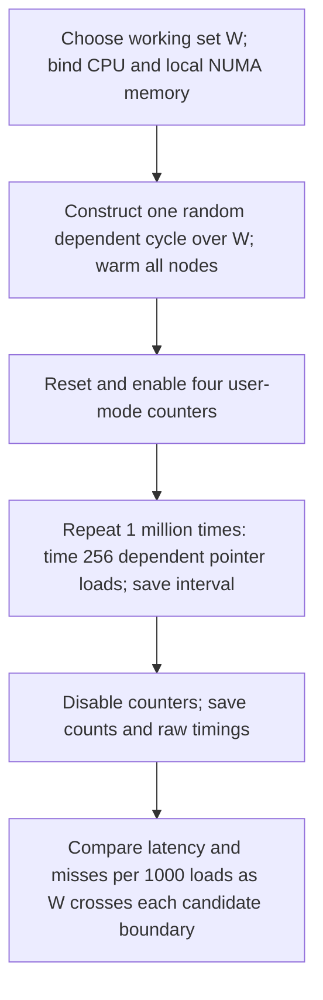

# Capacity verification with PMU counters

Sunbird: [capacity01](results/sunbird/capacity01/RUN_NOTES.md), covering fourteen
frozen Phase-I points in two counter passes each on CPU 32/node 0. See the Sunbird
configuration for its selected sizes and locally verified event encodings.

Charnwood's completed run is [capacity03](results/charnwood/capacity03/RUN_NOTES.md), with
[Section 8.3 comparison and limitations](../results/charnwood/REPORT.md).

Ookay: [capacity01](results/ookay/capacity01/RUN_NOTES.md) completes 14 representative points
with `configs/ookay.json`. See the [Section 8.3 comparison](../results/ookay/SECTION_8_3_REPORT.md).
The parameters below describe Artemisia; select `--machine ookay` for Ookay's own sizes and placement.

Upgrade's completed run is [capacity02](results/upgrade/capacity02/RUN_NOTES.md), using
`configs/upgrade.json`: CPU 2/node 0; L1 32, 36, 40, 48, 64 KiB; L2 256, 288, 384, 512 KiB;
LLC 4, 5, 6, 7, 8 MiB. These points follow Upgrade's frozen timing-only boundaries.
Use `--machine upgrade` and a fresh run ID to reproduce; live checks use `MACHINE=upgrade make check`.
The [Upgrade report](../reports/upgrade/README.md) includes the system/vendor comparison.

This small Section 8.3 experiment reruns 14 Artemisia capacity points using the existing randomized,
dependent pointer-chase workload. It measures the timing distribution and a group of four hardware
events during the same measurement loop.

## Run and analyze

From this directory, with Python dependencies from `requirements.txt`, GCC, binutils, perf, and numactl:

```bash
make check
python3 scripts/run_capacity.py --machine artemisia --run-id capacity02 --dry-run
python3 scripts/run_capacity.py --machine artemisia --run-id capacity02
python3 scripts/analyze_capacity.py --machine artemisia --run-id capacity02
```

`capacity01` completed all 14 points. See its [run notes](results/artemisia/capacity01/RUN_NOTES.md)
for the supported L1/L2 transitions and the unresolved LLC disagreement.
Use a new run ID for collection. Analysis can be repeated from the preserved raw data.

## Simple experiment design

| Region | Working sets |
|---|---|
| L1 | 32, 44, 48, 52, 64 KiB |
| L2 | 2, 2.25, 3, 4 MiB |
| LLC | 32, 40, 48, 56, 64 MiB |

All points use 1,000,000 timed batches after warm-up, 256 dependent loads per batch, 64-byte node
spacing, random seed 59202, and verified full 2 MiB transparent-huge-page backing. The 64-byte
spacing is a workload parameter, not a new line-size inference. Run order is shuffled with seed
59283. The worker is pinned to CPU 32 and memory is bound to NUMA node 1. No privileged host
settings are changed. All timing samples and outliers are retained.

The timing function and chain construction come from the capacity experiment. The complete timed
chain remains x86 assembly with 16 dependent loads per loop group and serialized RDTSC/RDTSCP.
Compile with `-O0`; `make` writes disassembly under `build/<machine>/`. PMU control is outside each
timed interval. No cache flush, extra eviction stream, or new traversal method is introduced.

## Counter scope and normalization

The four events, in order, are:

1. `mem_load_retired.l1_miss`: retired loads that miss L1.
2. `mem_load_retired.l2_miss`: retired loads that miss L2.
3. `mem_load_retired.l3_miss`: retired loads that miss L3.
4. `mem_inst_retired.all_loads`: retired load instructions, used to document overhead.

Descriptions and encodings are from the local event inventory. The runner checks the configured
raw encodings against `perf list --details` before collection. These encodings must not be copied
to another microarchitecture without checking them.

The C program uses `perf_event_open` to create a per-thread group with user-space counting only.
It opens the group before warm-up, resets/enables it immediately before the million-batch loop,
and disables/reads it immediately afterward. Initialization, warm-up, mapping inspection, and file
output are outside the counting window. The user-space calls and loop bookkeeping at its boundaries
remain included. Events are grouped and pinned; the program rejects unscheduled groups and any
run with unequal `time_enabled` and `time_running`. Counts are not multiplex-scaled.



Each point executes exactly `1,000,000 * 256 = 256,000,000` pointer-chase loads. The plotted quantity is:

```text
misses per 1,000 chain loads = raw miss count / 256,000,000 * 1,000
```

Counters include the helper/outer-loop user loads as well as the chain. The `all_loads` event exposes
that difference; these normalized counts are not exact per-address miss probabilities. Streaming
raw-result stores can also affect cache occupancy, as in the original workload. A retired-load miss
event is distinct from a request/refill/replacement event, and an L3 miss does not identify its eventual
data source. No instruction-address sampling or per-load PMU classification is performed.

The primary timer unit remains **TSC ticks per dependent load**, including the timer/loop overhead.
No fixed overhead is subtracted. This experiment does not measure calibrated core cycles/access.

## Outputs and interpretation

`data/<machine>/<run-id>/` contains the effective config, environment, build command/log, exact worker
commands, per-point mapping/interference logs, compressed `uint64` timing arrays, and raw counter JSON.
The analyzer reopens all arrays, verifies hashes and lengths, recomputes full statistics and ten temporal
medians, and checks the counter group and normalization denominator.

`results/<machine>/<run-id>/` contains:

- `summary.csv`: mean, sample standard deviation, median, quartiles, P05/P95/P99, extrema, Tukey
  outlier counts and whiskers, plus normalized event counts.
- `pmu_counts.csv`: raw event counts, raw encodings, denominator, enabled/running time, and normalization.
- `figures/capacity_pmu_validation.{png,pdf}`: timing-only and with-PMU curves above the corresponding
  miss-count curve. The timing-only values are read directly from the existing same-machine summary
  and matched on working set, samples, batch, spacing, seed, pages, and traversal mode.
- `figures/latency_boxplots.{png,pdf}`: all selected with-PMU distributions. Whiskers use 1.5 IQR;
  individual outlier markers are hidden, but no raw samples are removed.
- `figures/temporal_stability.{png,pdf}`, `temporal_medians.csv`, `quality.json`, and `validation.json`.

A capacity inference is supported when the timing change and the appropriate miss-count increase
coincide. Current shared-machine load may change the effective LLC residency and timing relative to
earlier collection. Report those disagreements; a broad or missing LLC transition does not establish
the physical LLC capacity. Integrity checks do not establish an uncontended cache state.

This implementation currently supports Linux x86-64 and simple raw event/umask configurations.
Another machine needs its own CPU/NUMA settings, representative sizes, and verified event definitions.
The Arm timer/PMU implementation is not part of this change.
