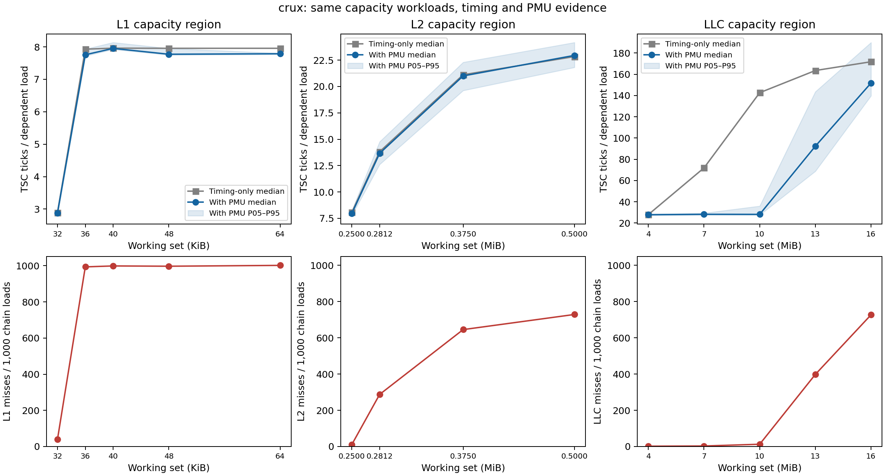

# Crux capacity PMU verification: capacity05

Completed 14 configurations with 1,000,000 timed batches each (14 million total), from 2026-09-14T15:44:49.981300+00:00 to 2026-09-14T15:45:43.777934+00:00. Total collection elapsed time: 53.80 seconds. All points use the four locally verified retired L1/L2/L3 load-miss and retired-load events.

[总体结论、系统/Agner 对照及分歧分析](../../../../results/crux/verification01/README.md)；[对照表](../../../../results/crux/verification01/comparison.md)。

CPU 6 / NUMA node 0; seed 59202; spacing 64 B; 256 dependent loads per sample; random cycle; full THP backing before and after every measured point. All 14 workloads exactly match frozen Phase-I points. The first point needed five allocation-only retries; its failed launch logs are retained. No measured point was imported from capacity01–04.

L1/L2 miss increases support the 32–36 KiB and 256–288 KiB timing boundaries. LLC misses rise clearly between sampled 10 and 13 MiB in this run, whereas Phase I had an earlier effective rise; this is a disagreement, not an exact verification of the earlier LLC boundary. The 13 MiB temporal median ratio is 1.20 and its P95 is 143.58 ticks/load. Shared-host interference and residency changes remain unresolved.

| Point | Median TSC ticks / timed chain load | L1 misses / 1000 | L2 misses / 1000 | L3 misses / 1000 |
|---|---:|---:|---:|---:|
| L1_w32768 | 2.8750 | 39.126 | 0.008 | 0.002 |
| L1_w36864 | 7.7578 | 993.700 | 0.018 | 0.013 |
| L1_w40960 | 7.9531 | 998.852 | 0.036 | 0.027 |
| L1_w49152 | 7.7734 | 997.304 | 0.012 | 0.006 |
| L1_w65536 | 7.7891 | 1001.943 | 0.013 | 0.007 |
| L2_w262144 | 7.9531 | 1000.256 | 10.763 | 0.009 |
| L2_w294912 | 13.6641 | 1000.995 | 287.723 | 0.012 |
| L2_w393216 | 21.0039 | 1000.655 | 645.482 | 0.000 |
| L2_w524288 | 22.9492 | 1000.236 | 729.050 | 0.000 |
| LLC_w4194304 | 27.7617 | 1000.788 | 973.931 | 1.824 |
| LLC_w7340032 | 28.1758 | 1000.623 | 985.365 | 3.017 |
| LLC_w10485760 | 28.1133 | 1000.821 | 989.708 | 12.672 |
| LLC_w13631488 | 92.2930 | 999.882 | 991.107 | 398.275 |
| LLC_w16777216 | 151.7383 | 1000.309 | 992.764 | 727.051 |

These counts include loop/helper loads and are not conditional cache-miss probabilities. Timing is in TSC ticks, includes overhead, and is not a calibrated core-cycle hit latency. Raw outliers are retained.

[Statistics](summary.csv), [PMU counts](pmu_counts.csv), [quality](quality.json), [validation](validation.json), [data manifest](../../../data/crux/capacity05/manifest.json), [source/binary archive](../../../data/crux/capacity05/reproduction/provenance.json). The latter is a post-collection snapshot; Phase-I was frozen separately before PMU probes.

[Comparison PDF](figures/capacity_pmu_validation.pdf); [box plots PNG](figures/latency_boxplots.png) / [PDF](figures/latency_boxplots.pdf). [Temporal stability PNG](figures/temporal_stability.png) / [PDF](figures/temporal_stability.pdf).
