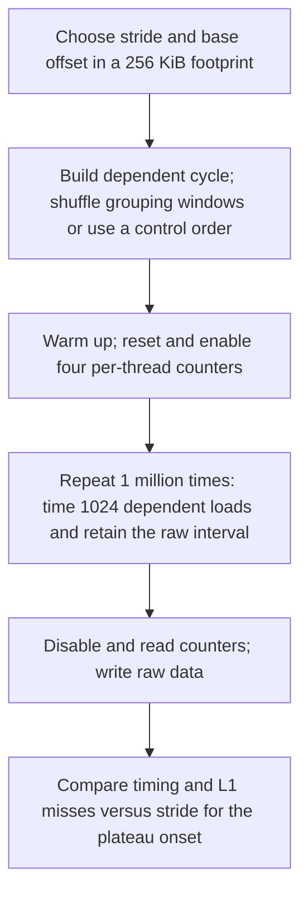

# Line-size PMU verification

Sunbird: [line_size01](results/sunbird/line_size01/RUN_NOTES.md), with the same twelve
stride/order/offset points, CPU 32/node 0, and two counter pairs per point. Its
configuration reads the frozen Phase-I summary. The detailed historical parameters
and placement below describe Artemisia unless stated otherwise.

Artemisia's completed run is [line_size01](results/artemisia/line_size01/RUN_NOTES.md).
Twelve representative configurations reproduce the existing grouping-window stride experiment
with four user-mode counters: retired L1/L2/L3 load misses and retired loads in total.

From this directory:

```bash
make all
python3 scripts/run_line_size.py --machine artemisia --run-id line_size02 --dry-run
python3 scripts/run_line_size.py --machine artemisia --run-id line_size02
python3 scripts/analyze_line_size.py --machine artemisia --run-id line_size02
```

Use a new run ID for collection. Dependencies are GCC/G++, binutils, perf, numactl, Python,
NumPy, and Matplotlib. Functional checks for both new experiments run with
`python3 ../common/test_verification.py -v` after building both benchmarks.

## Method and parameters

`configs/artemisia.json` selects a 256 KiB footprint, 512 B grouping window, 1,024 dependent loads
per timed batch, 1,000 warm-up batches, and 1,000,000 measured batches per configuration.
The grouping-window traversal and timer functions retain the existing timing-only implementation.
Windows are shuffled, while accesses within a window proceed in address order. The grouping window
is an access-order parameter, not the candidate line size.

- Random windows, offset 0 B: strides 32, 56, 64, 72, 96 B.
- Random windows, offset 16 B: strides 56, 64, 72 B.
- Sequential control, offset 0 B: strides 56, 64, 72 B.
- Fully random control, offset 0 B: stride 64 B.

Seeds match the corresponding original sweeps (701, 711, 721, 731). The process runs on CPU 32
with memory bound to NUMA node 1. The original data used CPU 4/node 0; CPU 4 was occupied by
another experiment, so the new placement and this comparison limit are explicitly recorded.



## Counting scope and implementation changes

The shared `../common/pmu.hpp` opens a pinned group with `perf_event_open`. Counting covers the
whole sample loop, excluding initialization, warm-up, mapping inspection, and file output. It includes
the C++ loop/timer helper's stack loads. The four raw event encodings are verified against local
`perf list --details`; unsupported or multiplexed groups cause failure.

The original code wrote formatted CSV during each sample iteration. This version stores raw ticks
in a prefaulted vector and writes binary output after counting, so formatting/I/O is excluded.
Allocation uses `posix_memalign` to preserve 64 B allocation alignment while accepting the extra
16 B offset portably. The candidate stride and offset remain independent of that allocation alignment.
Configuration structs are initialized. The dependent timed loop and pointer-order construction are
retained, but output buffering, placement, and compiled stack layout can affect absolute timing.
These are explicitly disclosed differences, not a bit-for-bit replay claim.

Normalization is `miss count / (samples * 1024) * 1000`. Values slightly above 1,000 are possible
because counters also count helper/stack accesses; they are not exact miss probabilities. The raw
`all_loads` count documents the extra loads. Timing uses TSC ticks per timed chain load, including
timer and `-O0` loop overhead, not calibrated CPU cycles. All sampled strides are multiples of eight
to avoid adding misaligned pointer accesses to the new validation subset.

The working mapping used base pages on this run. The experiment probes spatial reuse visible in
L1 for this footprint; it does not independently establish each deeper cache's line size or disable
prefetching. The controls test sensitivity to traversal order.

## Saved evidence

`data/<machine>/<run-id>/` retains the effective configuration, commands, build log, environment,
mapping/interference logs, PMU counts, and acquisition-order raw `uint64` intervals compressed with gzip.
`results/<machine>/<run-id>/` contains full timing statistics, raw/normalized event counts, temporal
medians, quality/validation records, and PNG/PDF comparison and box plots. Outliers are retained.
Legacy analysis reads the timing-only summary in place. Sunbird reads its separately created
Phase-I freeze, selected through `phase1_freeze` in its configuration.

Collection/analysis helpers live in `../common/` and reuse statistics helpers from
`../capacity/scripts/common.py`; keep the complete PMU-verification directory when reproducing.
The current PMU runner is for Linux x86-64; another machine needs its own verified event/placement
configuration. Arm PMU adaptation and literature/system verification are outside this run.
