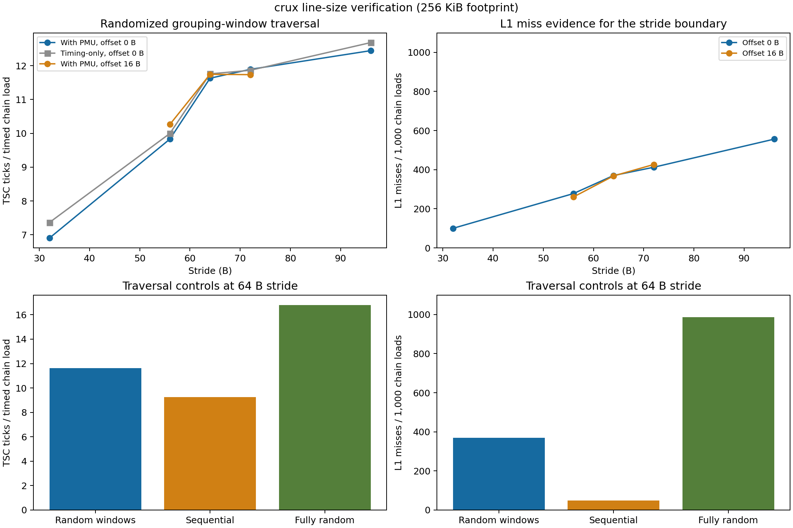

# Crux line_size PMU verification: line_size01

Completed 12 configurations with 1,000,000 timed batches each (12 million total), from 2026-09-14T15:38:43.684150+00:00 to 2026-09-14T15:39:34.454563+00:00. Total collection elapsed time: 50.77 seconds. All points use the four locally verified retired L1/L2/L3 load-miss and retired-load events.

[总体结论、系统/Agner 对照及分歧分析](../../../../results/crux/verification01/README.md)；[对照表](../../../../results/crux/verification01/comparison.md)。

CPU 4 / NUMA node 0; footprint 256 KiB; grouping window 512 B; 1024 chain loads per sample; 1000 warm-up batches. The 12 stride/offset/order points and seeds match the original Crux baselines and Artemisia representative workflow. All working mappings used base pages before and after collection.

The 64 B candidate is compatible with system geometry, but the grouped traversal has no clean 64 B L1-miss saturation plateau on Crux. At stride 64 B, sequential/random-window/fully-random L1 misses are 49.42/370.20/985.62 per 1000 chain loads. Access order is consequential; the 256 KiB footprint also reaches the L2-capacity region. Do not claim independent proof of every level’s line size or copy Artemisia’s stronger plateau interpretation.

| Point | Median TSC ticks / timed chain load | L1 misses / 1000 | L2 misses / 1000 | L3 misses / 1000 |
|---|---:|---:|---:|---:|
| fully_random_s64 | 16.7793 | 985.623 | 345.317 | 0.028 |
| random_s32_a0 | 6.9033 | 99.817 | 13.004 | 0.006 |
| random_s56_a0 | 9.8301 | 277.700 | 34.726 | 0.008 |
| random_s64_a0 | 11.6289 | 370.197 | 75.870 | 0.047 |
| random_s72_a0 | 11.8906 | 412.343 | 79.117 | 0.010 |
| random_s96_a0 | 12.4434 | 556.192 | 97.276 | 0.159 |
| random_s56_a16 | 10.2637 | 260.301 | 50.643 | 0.006 |
| random_s64_a16 | 11.7441 | 367.948 | 76.856 | 0.146 |
| random_s72_a16 | 11.7344 | 426.399 | 66.401 | 0.103 |
| sequential_s56 | 7.0625 | 41.190 | 0.751 | 0.014 |
| sequential_s64 | 9.2598 | 49.422 | 6.706 | 0.001 |
| sequential_s72 | 9.5732 | 78.250 | 10.032 | 0.024 |

These counts include loop/helper loads and are not conditional cache-miss probabilities. Timing is in TSC ticks, includes overhead, and is not a calibrated core-cycle hit latency. Raw outliers are retained.

[Statistics](summary.csv), [PMU counts](pmu_counts.csv), [quality](quality.json), [validation](validation.json), [data manifest](../../../data/crux/line_size01/manifest.json), [source/binary archive](../../../data/crux/line_size01/reproduction/provenance.json). The latter is a post-collection snapshot; Phase-I was frozen separately before PMU probes.

[Comparison PDF](figures/line_size_pmu_validation.pdf); [box plots PNG](figures/latency_boxplots.png) / [PDF](figures/latency_boxplots.pdf).
