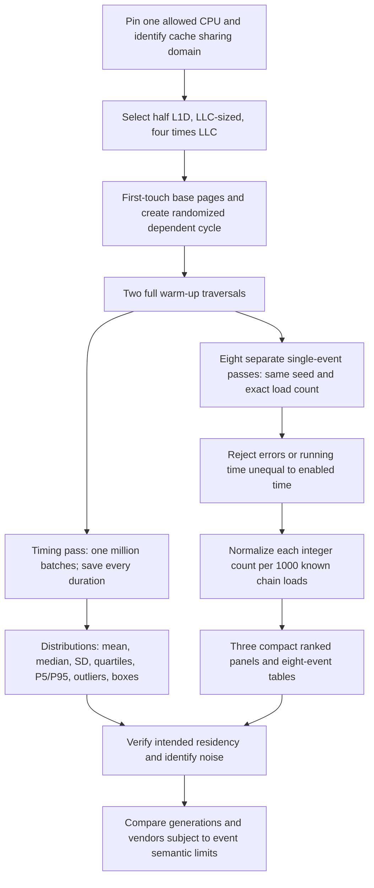

# Measurement logic and interpretation

Primary contributor: fill actual contributor in report.

## Timing and PMU intervals

`src/bench.cpp` is the complete main benchmark; compile at `-O0`. x86-64 uses LFENCE/RDTSC/LFENCE and a dependent MOV chain; AArch64 uses DSB/ISB/CNTVCT/ISB and dependent LDR. TSC ticks are not core cycles. Arm timer frequency is recorded from CNTFRQ but the default plots preserve raw timer units. Other Linux architectures have a CLOCK_MONOTONIC_RAW and volatile-load fallback, unvalidated here. AArch64 needs permitted unprivileged architectural timer access; a trapped timer fails rather than inventing data.

Timing samples measure a batch (default 64 loads), including call/loop/serialization overhead. Statistics are on batch-average ticks/access. Do not claim this is a distribution of individual-load latencies. Counter passes use one long dependent loop without sample-buffer writes or timer calls in its body. Therefore the two modes measure the same chain/workload and demand-load count but differ in instrumentation; the timing pass is contextual validation, not a simultaneous event attribution to each latency sample. Warm-up and allocation are excluded in both modes. A few user instructions around ioctl boundaries remain inside the counter interval. Counts are per thread, user mode, pinned, excluding kernel/hypervisor/guest, unscaled. One event per pass avoids multiplexing and generation-specific group constraints; event ratios would be across separate passes, not simultaneous observations.

All passes in one repetition use the same seed; repetitions change the seed. Explicit Fisher–Yates construction uses rejection sampling and mt19937_64, producing the same permutation for the same node count/seed independent of std::shuffle implementations. Workload and event pass order is randomized deterministically. Exactly one pointer is visited per node in a single complete cycle. All demand loads are read-only. PMU writes in a stores slot mostly measure scaffolding and should be near zero; this is an informative control, not a write-bandwidth experiment.

An LLC-sized random stream may distribute residency across private and shared levels. More-than-LLC behavior depends on sharing, interference, page translations, memory placement and prefetch. This suite does not re-infer cache boundaries (8.2/8.3 cover those). Base pages deliberately standardize page policy and may expose substantial TLB pressure. First touch is local at allocation; automatic NUMA migration and neighboring threads can still affect service. Activity snapshots alone cannot establish uncontended execution throughout.

## Eight-slot event policy and sources

The starting eight generic events follow section 8.4. Linux hardware-cache config uses cache ID | operation << 8 | result << 16. Raw fallbacks are CPU-profile-specific and derived from the local 8.3 inventories copied under `event_evidence/`; exact chosen mappings and logs are saved anew on each run. Intel raw encodings were taken from each host's own archived inventory. No Intel encodings are used on AMD or Arm.

- Linux PMU ABI, scheduling and mapping: https://www.man7.org/linux/man-pages/man2/perf_event_open.2.html (consulted 2026-09-14).
- Kernel UAPI definitions: https://github.com/torvalds/linux/blob/master/include/uapi/linux/perf_event.h (consulted 2026-09-14).
- Architecture-specific provenance: the copied `event_evidence/<host>/EVENTS.md` and `events.csv` from existing section 8.3. These are prior evidence, not claims of newly measured remote counters.
- Arm Neoverse N1 PMU Guide Issue 2.0, especially pp. 33, 38, 40–44, 52: https://documentation-service.arm.com/static/66ace6ee0469d5197d40c93e (source documented in existing 8.3 records).
- Generation launch year convention and primary references: `Table1_CPU_Architecture_Research.md` copied from the user's research file.

Use the generated `event_semantics.csv` beside every ranked figure. Generic event availability is necessary but not sufficient for equivalence. Generic cache references/misses have kernel/CPU-specific scope; L1 counters can count operations, retired uops, speculative requests, refills or allocation events. Substituting a proxy changes the measured quantity: never label an L2 request proxy as measured LLC requests.

AMD local cache fills do not count all LLC lookups; local DRAM/IO fills omit remote DRAM. Its MAB allocations previously failed to track the L1 transition; validate rather than assuming a miss probability. Arm last-level events are firmware/EXTLLC sensitive: the previous Thunderbird experiment did not validate these as SLC events. Intel Haswell retired uops differ from later retired instructions. A normalized count can exceed 1000 per 1000 chain loads because of extra traffic, speculation or different event scope; do not clamp it to a probability.

Numerical cross-vendor ranks are requested descriptive outputs, not proof that counters are semantically equal. Discuss comparable pairs/groups and noncomparable proxies explicitly. Avoid claiming an evolution trend from a vendor mix or server/desktop mix. Generated generation plots contain observations only, never a refitted Hazel prediction.

## Required final narrative

Use measured data to state how L1 misses/deeper traffic change between the three workloads, which systems rank highest/lowest on each defensible quantity, whether repeated passes agree, and how translation behavior and LLC sharing explain surprises. Compare older/newer Intel machines within matched semantics, then discuss AMD and Arm caveats with their observed numbers. Retain zero counts and anomalies with their errors/interpretation. Do not fill conclusions before all machines are collected.
