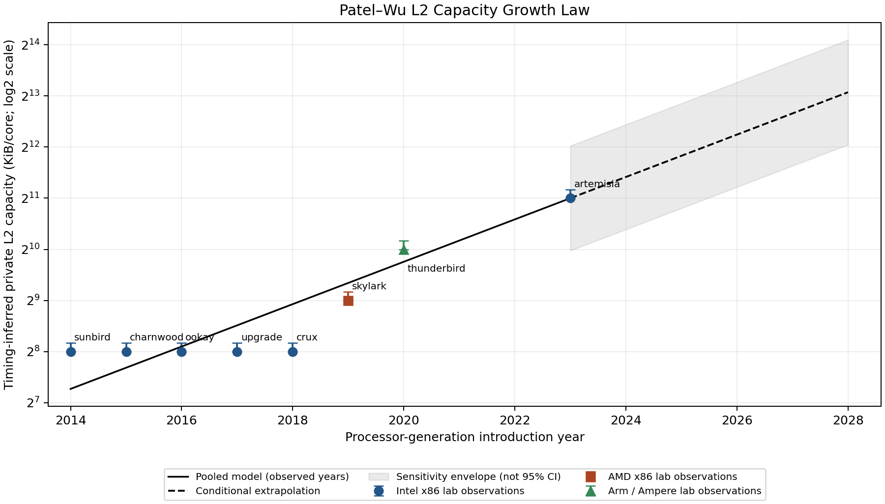
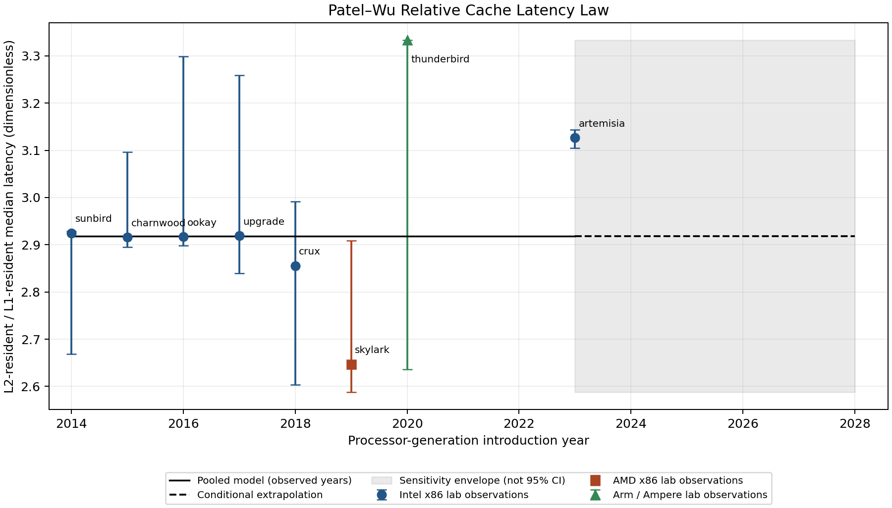

# 9.1 Your Team’s Cache Laws and Future Scaling Walls

**Experimental scope:** We did not complete the Hazel experiments because we ran out of time. Both Patel–Wu laws are based only on the eight ECE lab machines. The Hazel predictions are untested, and we cannot determine whether held-out measurements support, weaken, or falsify either law. A GitHub pre-experiment freeze is not verified by this package.

## Shared domain and measurement meaning

We propose two empirical, pooled cache laws from eight ECE lab machines spanning processor-generation introduction years 2014–2023. Six observations are Intel x86-64, one is AMD x86-64, and one is Ampere AArch64. The sample combines desktop and server processors. Our year convention is the first launch of the represented processor generation, following Table 1; it is not necessarily the individual SKU launch. Neither law is vendor-specific or universal. One AMD and one Ampere observation cannot establish vendor trends.

The capacity quantity is the timing-inferred private L2 capacity per core, not socket-total or shared LLC capacity. The cost quantity is R = median L2-resident pointer-chase time / median L1-resident pointer-chase time, computed within each host. Multiplicative timer units cancel in R. They do not eliminate differences in frequency during runs, instruction overhead, residency, contention or timer quantization. These are benchmark resident latencies, not isolated SRAM delays. Uncalibrated x86 TSC ticks must not be labeled core cycles or nanoseconds; the ratio permits a limited cross-ISA comparison without making that conversion.

**Table 9.1. Lab evidence.** Values come from the timing-only inference summaries referenced in `tables/lab_evidence.csv`; system specifications and PMU verification do not replace these observations. L2 brackets are sweep-resolution brackets, not confidence intervals. Latency envelopes are available in that CSV and are plotted in Figure 9.1b.

| Host | Year | Vendor / ISA | L2 KiB/core [bracket] | L2/L1 latency ratio |
|---|---:|---|---:|---:|
| Sunbird | 2014 | Intel / x86-64 | 256 [256, 288] | 2.9248 |
| Charnwood | 2015 | Intel / x86-64 | 256 [256, 288] | 2.9157 |
| Ookay | 2016 | Intel / x86-64 | 256 [256, 288] | 2.9170 |
| Upgrade | 2017 | Intel / x86-64 | 256 [256, 288] | 2.9188 |
| Crux | 2018 | Intel / x86-64 | 256 [256, 288] | 2.8555 |
| Skylark | 2019 | AMD / x86-64 | 512 [512, 576] | 2.6471 |
| Thunderbird | 2020 | Ampere / AArch64 | 1024 [1024, 1152] | 3.3333 |
| Artemisia | 2023 | Intel / x86-64 | 2048 [2048, 2304] | 3.1265 |

## Law 1: Patel–Wu L2 Capacity Growth Law

**Statement.** In our pooled 2014–2023 lab sample, private L2 capacity follows a coarse, stepwise growth pattern summarized by an endpoint-anchored exponential with approximately one doubling every 2.41 years.

**Quantitative rule.** For generation year t, our prediction is

\[
\widehat C_{L2}(t)=2048\;2^{0.4142857143(t-2023)}\quad\text{KiB/core}.
\]

The slope minimizes squared log2 residuals with the model constrained through the newest lab observation, Artemisia (2023, 2048 KiB). Specifically, b = Σ[(tᵢ−2023)log₂(Cᵢ/2048)] / Σ[(tᵢ−2023)²]. Thus the doubling time is 1/b = 2.4138 years and the annual multiplier is approximately 1.333. We preserve this existing Section 9 predictor rather than change its parameters for the law formulation.

**Evidence and interpretation.** The five earliest hosts all have 256 KiB; the final three have 512, 1024 and 2048 KiB. These are three upward sampled transitions and four unchanged transitions, not a literal annual production schedule. The anchored fit has an in-sample RMSE of 0.4928 log2 units and leave-one-host-out RMSE of 0.6060 log2 units (a multiplicative error scale of about 1.52). The unconstrained historical OLS fit is a different model: slope 0.3613/year, doubling time 2.7674 years, R² = 0.8178, and leave-one-out RMSE 0.6473 versus 1.2454 for a flat baseline. Its R² must not be attributed to the anchored law. Capacity most resembles Moore-style growth among the defensible quantities, but the long plateau makes a smooth exponential only a coarse description.

**Figure 9.1a.** Private L2 capacity against generation year, with a base-2 logarithmic vertical scale. Solid vendor-shaped markers identify all eight lab hosts; bars show inference brackets. The solid black curve is the pooled model within observed years, not a genealogy joining unrelated architectures. The dashed curve begins at the measured 2023 capacity anchor and extends to the conditional 2028 scenario. Shading is an uncalibrated sensitivity envelope. No Hazel reveal marker is drawn because no held-out observation is available. The strongest pattern is a 2014–2018 plateau followed by larger sampled capacities.

**Predictions and uncertainty.** The nine Hazel targets and exact law predictions appear in `tables/hazel_predictions.csv`. For example, the held-out Turin generation (2024) is predicted at approximately 2729 KiB/core; use the CSV for full precision and bounds. This is a continuous model output, not a claim that a physical implementation offers that exact capacity. The envelope unions leave-one-host-out refits, fits using all lower/all upper measurement brackets, and a multiplicative band based on the maximum absolute lab leave-one-out log2 error (1.0251). It has no assigned coverage probability. These predictions were prepared but are not certified as GitHub-frozen or experimentally tested. We did not complete the Hazel experiments because we ran out of time.

**Scope and failure modes.** Four Intel desktop observations remain at 256 KiB, whereas the newest anchor is a server. Within Intel alone, historical-model leave-one-out RMSE is 1.3656 log2 units versus 1.3416 for the flat baseline: this weakens a simple year-driven explanation. Vendor, product class and year are confounded. New sharing policies, additional levels, chiplets, different workloads, or shifts in silicon budgets may break the rule. Extrapolating to AMD remains explicitly pooled. Same-generation Hazel targets test another machine, not a genuinely unseen architectural generation.

### Capacity scaling wall

Indefinite exponential growth of private L2 capacity is implausible under a bounded per-core area, access-time and power budget. As an engineering model, capacity can be written C ≈ ρ·A_eff, where ρ is usable SRAM-bit density and A_eff is array area after tags, redundancy and peripheral overhead. Even increasing density does not by itself shorten all access paths. Larger arrays require decoding, bitline sensing and movement of data over distance. Physical SRAM and wire delay constrain how much storage can be accessed within a fixed time. Banked and nonuniform designs explicitly expose the interaction between cache size, placement and access latency; this is a mechanism, not a measured wall year for our processors. [Kim, Burger and Keckler, ASPLOS 2002](https://www.cs.utexas.edu/~skeckler/pubs/asplos02.pdf).

The engineering tradeoffs include leakage from more cells and dynamic energy in arrays and interconnect. Banking and slicing can improve locality and parallel throughput but add routing/control costs. Moving storage into a shared or chiplet-level cache changes both physical distance and the sharing domain, so package cache growth does not establish continued private-L2 growth. Coherence traffic and per-core effective availability depend on how the added capacity is shared. Models such as [CACTI](https://github.com/HewlettPackard/cacti) jointly evaluate access time, area, leakage and dynamic power; we have not run such a calibrated design study here.

The **technology limit** is finite device/interconnect speed, SRAM density and energy at a given process and physical layout. The **design/economic limit** is the amount of die area, power and manufacturing cost worth spending on L2 rather than cores or other resources. A design may stop scaling well before any hard physical maximum. Our expectation is **piecewise growth with plateaus or flattening**, possibly moving capacity to other levels, rather than indefinitely preserving this slope.

The observations do not identify a maximum KiB/core, saturation year or confidence interval for a wall. Estimating one requires comparable-process SRAM macro density and delay, actual array area and geometry, energy/leakage measurements, power/thermal budgets, and a controlled size/banking sweep at fixed frequency and workload. The forecast uncertainty below is uncertainty in an empirical continuation, not an estimated physical limit.

## Law 2: Patel–Wu Relative Cache Latency Law

**Statement.** Across the same pooled lab years, L2-resident dependent-load latency remains approximately three times L1-resident latency, with no strong monotonic year trend.

**Quantitative rule.** We use the constant empirical-median model

\[
\widehat R(t)=\operatorname{median}_i(T_{L2,i}/T_{L1,i})=2.9179178548.
\]

This is a zero-slope reference law, not a claim of zero absolute latency growth. The observed central ratios range from 2.6471 to 3.3333; the descriptive within-host envelope spans [2.5882, 3.3333]. For each host the lower envelope uses L2’s lower latency bound divided by L1’s upper bound, and the upper envelope uses the opposite extrema. These extrema span resident configurations and are not independent statistical confidence limits. The constant model’s in-sample RMSE is 0.1915 ratio units. A separate linear-in-year diagnostic has slope 0.02785/year and R² = 0.1633, which is weak evidence for extrapolating increasing relative latency.

**Figure 9.1b.** L2/L1 resident-latency ratio by generation year. Eight solid vendor-shaped observations and descriptive error bars are plotted together. The solid black line is the pooled median during observed years; its dashed continuation is the same prediction after 2023. It starts at the model endpoint, rather than passing through Artemisia’s individual ratio, because the model is a pooled median. No unrelated architectures are connected by an observed lineage line. The weak, non-monotonic pattern supports a constant reference with variability rather than a growth trend. The shaded envelope is not a 95% prediction interval and no Hazel observations are shown.

**Frozen-prediction preparation and limitations.** Each planned Hazel target receives the same prediction, 2.9179, with the descriptive range [2.5882, 3.3333]. We did not complete the Hazel experiments because we ran out of time; therefore this law has no held-out validation. The unexecuted procedure is retained in `HAZEL_PROTOCOL.md` for documentation. The law may fail when pipeline depth, cache placement, power management or cache-resident access patterns change. The AArch64 timer’s coarser scale can affect a ratio formed from short timing measurements; cancellation of units does not recover missing timing resolution. A nearly constant ratio cannot imply that either absolute latency is constant, or that Intel, AMD and Arm have identical cache implementations.

### Relative-latency scaling wall

A constant dimensionless ratio has no inherent deadline: both numerator and denominator can rise or fall together. The constrained claim is therefore stability under comparable resident, dependent-load measurements, not unlimited improvement in physical access time. A useful engineering decomposition is T ≈ T_array + T_wire + T_pipeline + T_queue. Device switching, sensing and finite travel distance constrain true access time; placement and nonuniform banking can give physically distant data different access times. [Kim, Burger and Keckler, ASPLOS 2002](https://www.cs.utexas.edu/~skeckler/pubs/asplos02.pdf).

For a capacity-growing L2 and tightly budgeted L1, the ratio may rise when L2 requires another pipeline stage or a longer route. Changing the clock period changes time measured in cycles without necessarily improving nanoseconds. Queueing/contention and topology can add further latency, so unloaded dependent-chain measurements must be distinguished from loaded throughput. Speculation, prefetching and memory-level parallelism can hide a wait or overlap independent accesses; they do not reduce the true dependency latency of a single access. Our dependent pointer-chase ratio intentionally limits that overlap, but still includes benchmark overhead.

The **technology limit** concerns SRAM/wire/device delay at a given placement and process. The **design/economic limit** concerns chosen frequency, pipeline depth, power budget, bank count and the value of spending area to reduce latency. Designers can hold a ratio roughly stable by co-designing both levels, or improve throughput while accepting a higher ratio. We expect **piecewise stability with possible upward steps** if L2 continues expanding while L1 remains latency-critical; reversal is also possible after an architectural redesign. The measured range is not a hard lower/upper bound.

An exact future ratio ceiling or turning year is unsupported. Required evidence includes calibrated time and core-cycle measurements for both levels, frequency logs, array geometry and pipeline stages, repeat runs, residency validation, and controlled contention/banking experiments. Separate latency-hiding experiments would establish whether application speedups reflect true latency reduction or overlap.

## Further quantitative scenario and overall interpretation

**Conditional five-year scenario.** The newest measured system is a 2023 generation, so the lab-only five-year horizon is 2028. Continuing the unchanged laws yields **8607.80 KiB/core (8.41 MiB/core)** for L2, with sensitivity range **4229.59–17518.05 KiB/core (4.13–17.11 MiB/core)**; the ratio remains **2.9179 [2.5882, 3.3333]**. These outputs are in `tables/conditional_forecast.csv` and Figures 9.1a–b. They are not technology-roadmap claims or calibrated confidence intervals. Long-range model misspecification may exceed the displayed bands. Because we ran out of time and did not complete Hazel experiments, 2023 remains our newest measured generation. This is a lab-only forecast; the assignment’s requested post-Hazel evaluation and subsequent forecast were not completed.

1. **Approximately constant quantities:** L2/L1 relative latency is roughly stable. L1D is 32 KiB in six hosts, with steps to 64 KiB on Thunderbird and 48 KiB on Artemisia. The four sampled Intel desktops have constant 256 KiB L2. Timing-only line-size inference remains unresolved; later verification must not be represented as a timing-derived constant law.
2. **Growth form:** L2 grows by sampled steps. An exponential is useful as a coarse pooled forecast, with the stated 2.41-year anchored doubling time; it is not evidence of smooth annual growth.
3. **Capacity versus latency:** From Sunbird to Artemisia, L2 capacity rises eightfold while the relative resident cost rises from 2.9248 to 3.1265 (about 6.9%). Skylark breaks a simple increasing-ratio sequence. Thus larger capacity can coexist with some relative cost increase, but these hosts do not establish a universal causal tradeoff. DRAM penalties additionally depend on memory technology, NUMA locality, allocation and server configuration; no CPU-year-only DRAM law is justified here.
4. **Vendor/ISA versus product class:** Intel desktop/server differences are visible; one AMD and one Ampere point cannot separate vendor, ISA, process and generation effects. We therefore use pooled, explicitly limited rules rather than three vendor laws.
5. **Moore-style evidence:** L2 is the strongest chronological capacity association, with numerical fit diagnostics given above. The ratio is better described as an approximate invariant. Eight heterogeneous hosts and nine years offer a narrow, confounded basis for extrapolation; the word “Law” is an assignment name for a falsifiable empirical model, not a physical law.
6. **Hazel evaluation:** We did not complete the Hazel experiments because we ran out of time. Consequently, we cannot report held-out prediction errors or supports/weakens/falsifies verdicts for either law. Prepared predictions alone do not count as a held-out test. The figures contain lab observations and model projections only; there are no Hazel reveal markers.

**Evidence provenance.** Numerical results use `../section9_moore_analysis/predictions/model_training_points.csv`, `model_parameters.json`, `hazel_predictions.csv`, and `../section9_moore_analysis/tables/trend_summary.csv`. Source hashes are in `provenance.json`; per-host raw-result paths are retained in the evidence CSV. The technical references support mechanisms only; no external target cache specifications enter either fit or prediction.
